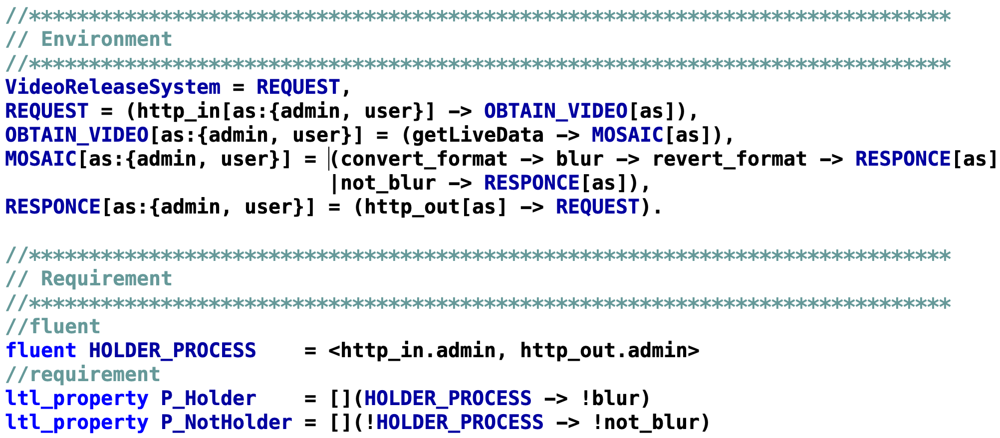

# Controller to Node-RED Translator (CNT)

## Overview
We present a controller to Node-RED translator (CNT), a tool for developing Node-RED systems that are safe and easy to update continuously. CNT introduces the discrete controller synthesis to conventional Node-RED systems to provide a guarantee of flow correctness (safety). Flow correctness, which essentially means that the nodes fire at the timing intended by the designer, is crucial in smart city systems that require frequent application updates with no room for design errors. In this work, we propose a method for developing a Node-RED system using CNT along with its accompanying algorithm. We also report the results of experiments that demonstrate the usefulness of the proposed method.  
  

  

## Configuration
There are three types of tools available here. The roles and details of each tool are shown below.  
  
* M-Sec_Translator (CNT)
> This is the main tool of this research, which converts the controllers automatically generated by MTSA into ".json" format that can be used with Node-Red.  
  
* M-Sec_Node-RED
> We have prepared Node-Red as a development environment with docker. You can read the ".json" file converted by CNT in this environment. Our Node-RED is equipped with SoxFire, which is used for developing smart city systems. We recommend that you use our Node-RED to run the sample program. You can get the general Node-Red from this URL (https://www.npmjs.com/package/node-red).  
  
* M-Sec_DemoTool
> To demonstrate the effectiveness of this research, the M-Sec project has created a demonstration system. As a demonstration system, we designed a video release system. By using Node-RED to send video to this demo system via http request, the sent video will be displayed. Since there are two types of video destinations (user types), Node-RED can guarantee privacy requirements that vary depending on the user. 

  
In addition, the discrete controller synthesis tool "MTSA" is required for development using this tool.
MTSA can be obtained from this URL (https://mtsa.dc.uba.ar/).
  

## How to use
In this research, we propose a method for developing Node- RED systems using discrete controller synthesis (DCS), as shown in the following figure, to resolve the issues of safety assurance and update effort in conventional Node-RED.

  
Initially, the designer designs the environment model and the safety requirements, and then the environment models and the safety requirements are designed by FSP and FLTL, respectively. The actual data to be entered will be a script like the following.

  
By invoking MTSA, you can get the Controller script as shown in the following figure.
")
  
Next, enter this Contorller script and the dictionary data shown in the following figure into CNT. This dictionary data is a script that describes which node the controller event represents in Node-RED.
")
  
From these two inputs, you can get the flow data (in json format). CNT then uses the controller and dictionary data to automatically generate a Node-RED program that is guaranteed to be safe. By loading this Node-RED program in Node-RED, we can achieve a Node-RED system with guaranteed safety requirements. Once the flow data has been loaded into Node-RED, the entire task is complete. And you can get the flow as shown in the following figure.

  
  
Detailed instructions for each tool can be found in the README of each folder (each tool).